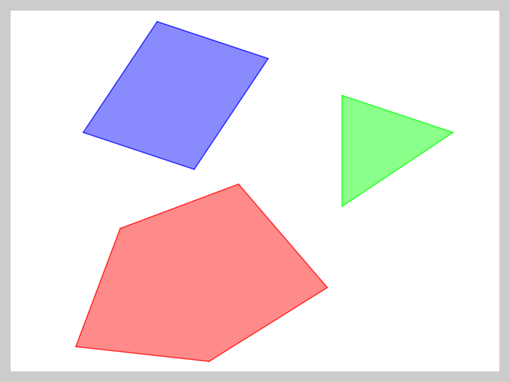
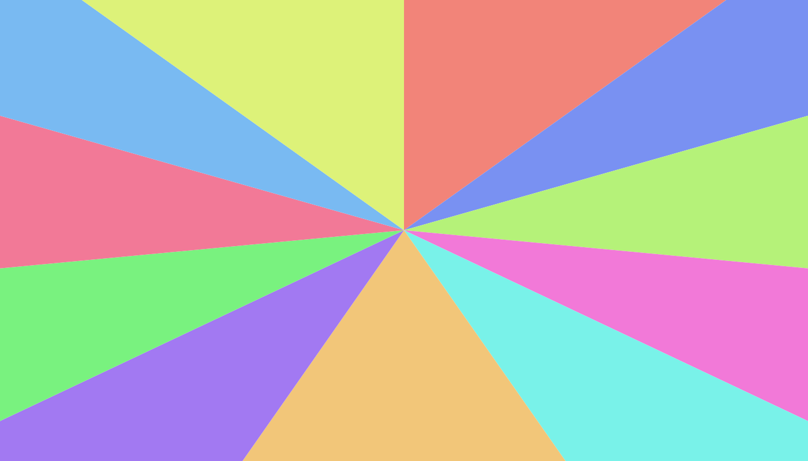

# ✂️ Cutting a rectangle into parts of equal area
## 💭 Introduction

This small POC has been developed to solve a problem from a friend of mine. He was working on a game that can be played by teams of players on a rectangular map. He ask me how could he spawn the teams on the map by preserving the balance of the game. So the first idea that came to my mind was to cut the map into parts of equal area and then spawn the teams on these parts. This is how I came up with this problem and I thought it would be interesting to explain the approach I used to solve it, as it is not a particularly difficult problem but it is still fun to solve.

## 🧩 Problem statement

The problem is to cut a rectangle `R` of dimensions `L` (length)  and `W` (width) of center `C` into `N` [simple polygons](#-simple-polygon) `P` of equal [area](#-area-of-a-polygon), with the given constraints:
- `N > 1`
	- *There must be at least two parts*
- `0 < W ≤ L`
	- *The width is smaller than the length of `R`*
- `0 < c.x < L` and `0 < c.y < W`
	- *The center `C` is inside `R`*
- `∀ i ∈ [1, N], P(i) ⊂ R`
	- *Each part must be inside `R`*
- `∀ i ∈ [1, N], ∃! v ∈ P(i), v = C`
	- *Each part must contain the center of `R`*
- `∀i, j ∈ [1, N], i ≠ j, P(i) ∩ P(j) = ∅`
	- *The parts must not overlap*
- `Area(R) = ∑ P(i)`
	- *The sum of the areas of the parts is equal to the area of `R`*
- `∀ i ∈ [1, N], Area(P(i)) = Area(R) / N`
	- *The area of each part is equal to the area of `R` divided by `N`*

## 📖 Definitions
### 📄 Area of a polygon

Let `p` be a polygon of `n` vertices where `p = {v(1), v(2), ..., v(n)}`.
The area of `p` is defined as follows with `i = 1 .. n` and `v(n + 1) = v(1)`:
```
Area(p) = ½ * ∑ (v(i) ∧ v(i + 1))
```
with `a ∧ b` the cross product of `a` and `b`.

### 📄 Simple polygon

A polygon is simple if it does not intersect itself.
In other words, a polygon is simple if it does not have any self-intersection.


**Figure 1:** *Example of simple polygons*

## 🗝️ Solution
### 📜 General approach
#### 💡 Initial considerations

We consider that each polygon `P(i)` always contains the center `C` of `R` as the first vertex `v(1)`.

Let `PR` be the polygon representing the rectangle `R`.

We already know the following properties:
- `Area(R) = L * W`
- `3 ≤ |P(i)| ≤ 5` with `|P(i)|` the number of vertices of `P(i)`. **Proof:**
	- `|P(i)| < 3 ⇒ Area(P(i)) = 0 < Area(R) / N`
	- `|P(i)| = 3 ⇒ P(i) = { C, v(2), v(3) }`
		- *A triangle touches only one side of `R`*
	- `|P(i)| = 4 ⇒ P(i) = {C, v(2), PR(j), v(4)}` such that `PR(j)` is a vertex of `PR` with `j = 1 .. 4`
		- *A quadrilateral touches two sides of `R`*
	- `|P(i)| = 5 ⇒ P(i) = {C, v(2), PR(j), PR(((j + 1) mod 4) + 1), v(5)}` such that `PR(j)` and `PR(((j + 1) mod 4) + 1)` are two consecutive vertices of `PR` with `j = 1 .. 4`
		- *A pentagon touches three sides of `R`*
		- *This case only occurs if `N = 2`*

The main idea is to build the polygons `P(i)` one by one, starting with `P(1)` and ending with `P(N)` in clockwise order. So each polygon `P(i)` is built from the previous polygon `P(i - 1)`.

#### 🔎 How to find the vertices of `P(i)`?

The first vertex `v(1)` of `P(i)` is the center `C` of `R`.

In order to find the second vertex `v(2)` of `P(i)`, we have 2 possibilities:
- If this is the first polygon, so we can choose any vertex intersecting `PR`.
Let `v(2) = (L / 2, 0)` in this case.
- Else `v(2) = u(n)` with `u(n)` the last vertex of the previous polygon.

Then, we have to find the next vertices by adding those from `PR` in clockwise order until `Area(P(i)) >= AP` with `AP = Area(R) / N`.

The polygon `P(i)` now contains `C, v(2), ..., v(n)` with `n ≥ 3`.
If `Area(P(i)) = AP`, then we have found the solution.

##### 🔎 How to find the correct value of `v(n)` if `Area(P(i)) > AP`?

In this case, we have to fix the last vertex `v(n)` of `P(i)` to make `Area(P(i)) = AP`.
The associated equation is:
```
   AP = ½ * ∑ (v(i) ∧ v(i + 1))
⇔ AP = ½ * (C ∧ v(2) + ... + v(n - 1) ∧ v(n) + v(n) ∧ C)
```
Let `S = C ∧ v(2) + ... + v(n - 2) ∧ v(n - 1)`, we have:
```
   AP = ½ * (S + v(n - 1) ∧ v(n) + v(n) ∧ C)
⇔ 2 * A = S + v(n - 1) ∧ v(n) + v(n) ∧ C
⇒ v(n).x = (2 * A - S - v(n).y * (v(n - 1).x - C.x)) / (C.y - v(n - 1).y)
⇒ v(n).y = (2 * A - S - v(n).x * (v(n - 1).y - C.y)) / (C.x - v(n - 1).x)
```
As each side of `R` is horizontal or vertical, we can deduce the value of `v(n).x` or `v(n).y` from the value of `v(n).y` or `v(n).x` respectively because `v(n).x = v(n - 1).x` or `v(n).y = v(n - 1).y` depending on the side of `R` that `v(n - 1)` and `v(n)` touch.

### 📈 Complexity analysis
#### ⏳ Time complexity

The time complexity of the algorithm is `O(N)` with `N` the number of parts.

#### 💾 Space complexity

The space complexity of the algorithm is `O(N)` with `N` the number of parts.
As shown in the [📜 General approach](#-general-approach) section, each polygon contains at most 5 vertices.

### 📝 Implementation

The implementation of the algorithm in Python is available in the [nparts.py](srcs/nparts.py) file.

There are two versions of the program, one with a CLI and one with a GUI.

#### ⌨️ CLI version

The program can be run with the following command:
```bash
python3 cli.py 100 60 3
```
- *It takes 3 arguments: `L`, `W` and `N`*

#### 🎨 GUI version

- ⚠️ This version requires [PySide6](https://pypi.org/project/PySide6) to be installed.

The GUI version can be run with the following command:
```bash
python3 gui.py 7
```
- *It takes a single argument: `N`*


**Figure 2:** *Some cool stuff you can generate with the GUI version*

## ✅ Conclusion

As indicated in the [🗝️ Solution](#️-solution) section, the algorithm is quite simple to implement and the time and space complexities are linear with the number of parts.

It could be possible to add a parameter to the algorithm to allow the user to choose the starting angle to build the polygons. As a reminder, the algorithm builds the polygons in clockwise order like an analog clock starting at 12 o'clock.

We could think of a generalization of the problem where the rectangle `R` is replaced by a simple polygon... Maybe for another time! 😉

## 📚 References

- [Area of a polygon](https://www.mathopenref.com/coordpolygonarea.html) - *Math Open Reference*
- [Simple polygon](https://en.wikipedia.org/wiki/Simple_polygon) - *Wikipedia*
- [Random color generator](https://martin.ankerl.com/2009/12/09/how-to-create-random-colors-programmatically) - *Martin Leitner-Ankerl's blog*
